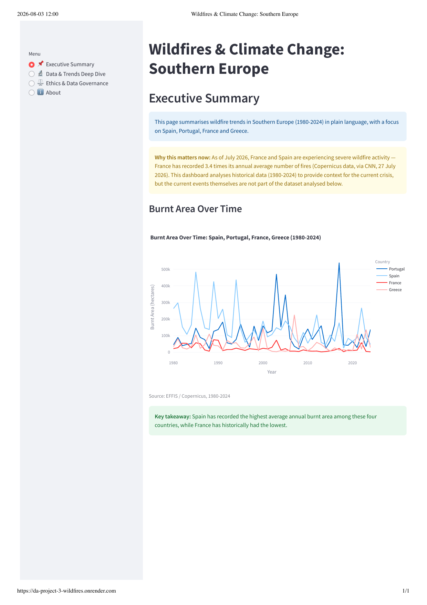
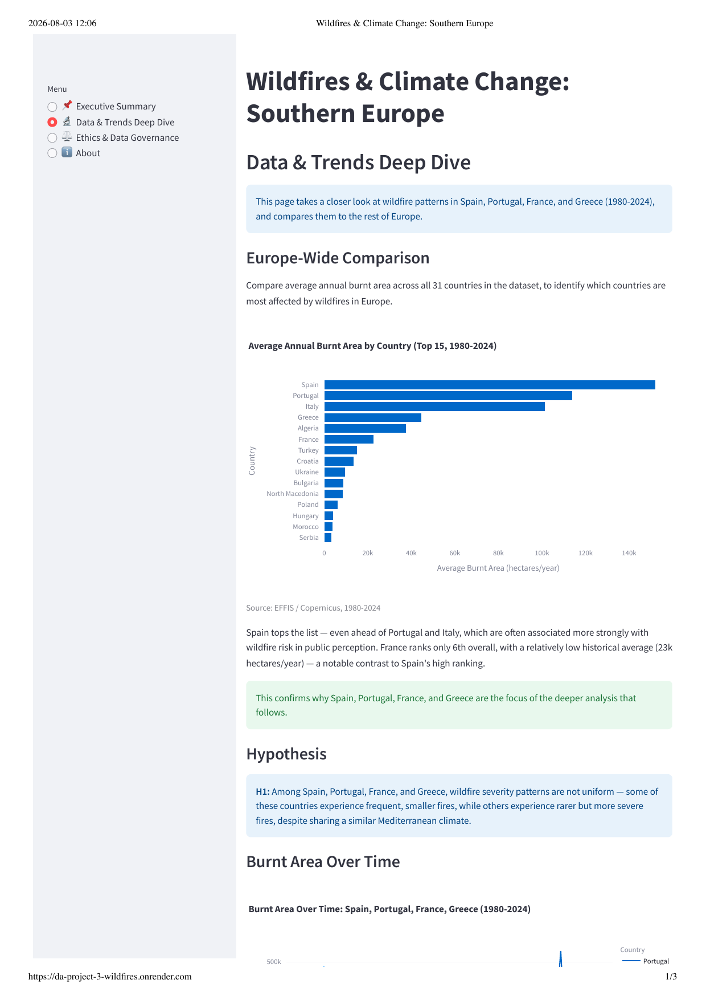
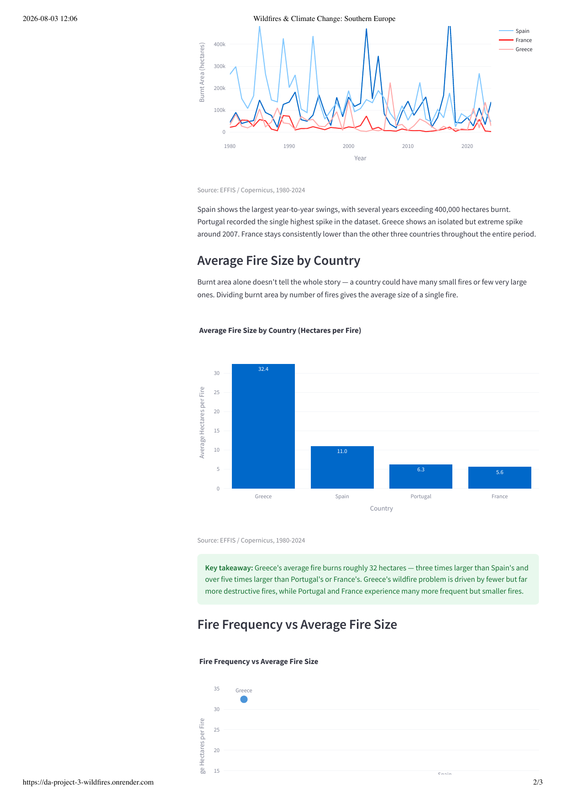
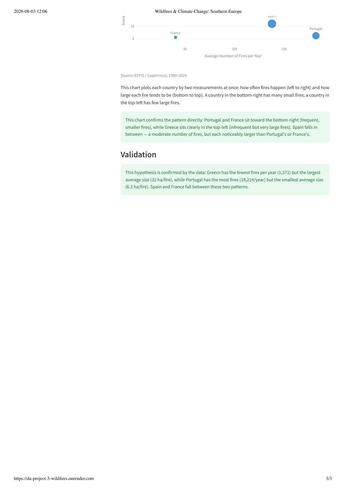
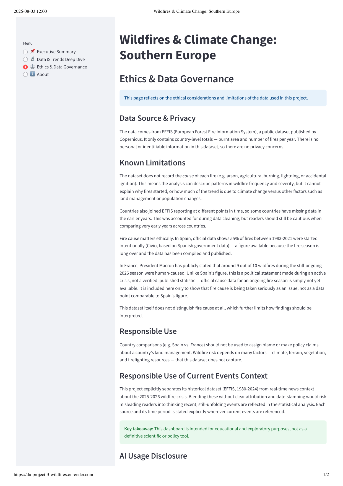
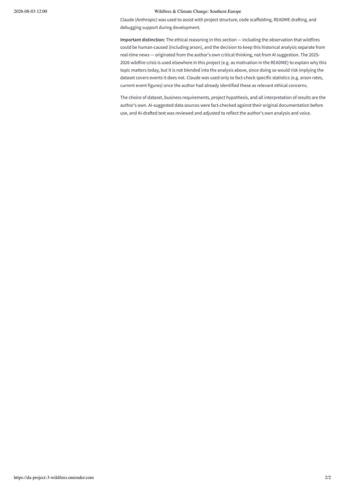
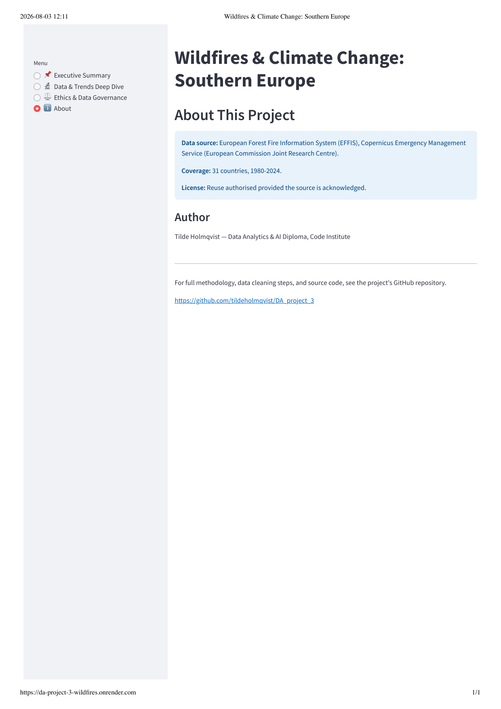
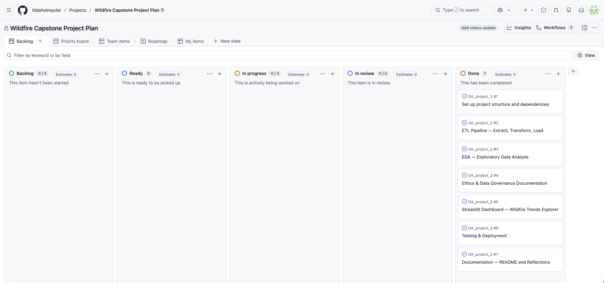

# Wildfires and Climate Change: Trends in Southern Europe (1980–2024)

*Ethical practice and communication in data — Capstone Project*

## Table of Contents
1. [Introduction & Motivation](#introduction--motivation)
2. [Dataset Content](#dataset-content)
3. [Business Requirements](#business-requirements)
4. [Project Hypothesis and Validation](#project-hypothesis-and-validation)
5. [Audience](#audience)
6. [Ethics, Privacy and Data Governance](#ethics-privacy-and-data-governance)
7. [Dashboard Design](#dashboard-design)
8. [Project Plan](#project-plan)
9. [Testing & Validation](#testing--validation)
10. [Unfixed Bugs](#unfixed-bugs)
11. [Future Improvements](#future-improvements)
12. [Reflection on Challenges](#reflection-on-challenges)
13. [Technologies Used](#technologies-used)
14. [How to Run](#how-to-run)
15. [Credits and Acknowledgements](#credits-and-acknowledgements)

---

## Introduction & Motivation

In July 2026, wildfires forced over 300,000 evacuations across Spain and
France; Spain declared its first-ever national wildfire emergency. As of
July 2026, France had recorded 3.4 times its annual average number of
fires, and Spain 1.7 times its average
([Copernicus data, via CNN, 27 July 2026](https://www.cnn.com/2026/07/27/world/live-news/france-spain-wildfires-evacuations)).

This project uses 45 years of official EU wildfire statistics (1980-2024) to
explore whether the current crisis reflects a longer-term pattern, or whether
it marks a departure from historical norms — with a particular focus on
Spain, Portugal, France, and Greece.

*Note: this dataset covers 1980-2024. The 2025-2026 crisis referenced above
is not part of the statistical analysis, but provides real-world context for
why this topic is relevant today. See the Ethics section for more on how
these are kept separate.*

---

## Dataset Content

- **Source:** European Forest Fire Information System (EFFIS), Copernicus
  Emergency Management Service (European Commission Joint Research Centre)
- **Original download:** https://forest-fire.emergency.copernicus.eu/applications/data-and-services
  ("Country totals" report)
- **License:** EFFIS data reuse terms — source must be acknowledged
- **Coverage:** 31 countries across Europe, MENA; 1980-2024 (individual
  countries joined EFFIS reporting at different times — see Data Cleaning
  notebook for details)
- **Public data, no personal or sensitive information** — this is
  country-level aggregate government statistical data, not individual
  records, so no anonymisation was required

### Raw Data Structure

The raw data was provided as two separate files, each in **wide format**
(one column per country, one row per year):
- `burnt_area_ha_1980_2024.csv` — burnt area in hectares
- `number_of_fires_1980_2024.csv` — number of recorded forest fires

### Processed Data

These two files were cleaned and combined into a single, tidy **long-format**
dataset (`inputs/processed/wildfires_long_format.csv`, 922 rows), with one
row per country-year combination. This was necessary for two reasons:
1. **Reshaping (wide → long)** made it possible to filter and group by
   country using simple pandas code, rather than referencing 31 separate
   columns
2. **Merging** the two files into one table made it possible to calculate
   new metrics — such as average hectares burnt per fire — by combining
   both indicators in the same row

### What the Data Actually Contains

The processed dataset (`wildfires_long_format.csv`) contains one row per
country per year (1980-2024), with the following fields:

| Column | Description |
|---|---|
| `Year` | The calendar year of the record (1980–2024) |
| `country_iso3` | Three-letter country code (ISO 3166-1 alpha-3), e.g. `ESP` for Spain |
| `country_name` | Full country name, e.g. "Spain" — added for readability |
| `burnt_area_ha` | Total land area burnt by wildfires that year, in hectares |
| `number_of_fires` | Total number of separate recorded wildfire events that year |

Each row therefore answers the question: *"In this specific country, in
this specific year, how much land burned, and across how many separate
fires?"* The dataset does not include information below the country level
(e.g. no regional or municipal breakdown) and does not record any
information about individual fires beyond the yearly national totals — no
location, date, duration, or cause of any single fire is available.

Full methodology is documented in `jupyter_notebooks/01_data_cleaning.ipynb`.

---

## Business Requirements

- **BR1:** As a policymaker or member of the public, I want to see how burnt
  area and number of wildfires have evolved over time in Spain, Portugal,
  France, and Greece, so that I can judge whether recent fire seasons are
  part of a long-term trend or an anomaly.
- **BR2:** As a non-technical user, I want a simple comparison between
  countries, so that I can understand which countries are most affected
  without needing to interpret raw statistics myself.
- **BR3:** As an analyst, I want to understand whether wildfire severity
  differs in *character* (frequent small fires vs. rare large fires) between
  countries, not just in total scale.

---

## Project Hypothesis and Validation

**H1:** Among Spain, Portugal, France, and Greece, wildfire severity patterns
are not uniform — some of these countries experience frequent, smaller fires,
while others experience rarer but more severe fires, despite sharing a
similar Mediterranean climate.

**Validation:** This hypothesis is confirmed by the data: Greece has the
fewest fires per year (1,371) but the largest average size (32 ha/fire),
while Portugal has the most fires (18,214/year) but the smallest average
size (6.3 ha/fire). Spain and France fall between these two patterns.

Full analysis, charts, and supporting evidence are documented in
`jupyter_notebooks/02_eda.ipynb` and reproduced in the Streamlit dashboard's
Data & Trends Deep Dive page.

---

## Audience

- **Non-technical audience** (general public, policymakers without a data
  background): interested in "what does this mean for my region/country" —
  served via the Executive Summary dashboard page, with plain-language
  takeaways and simple, clearly-labelled charts. This project is written for
  a reader with zero prior knowledge of climate science or data analysis.
- **Technical audience** (mentors, fellow students, data-literate
  stakeholders): interested in data source, cleaning methodology, and
  statistical detail — served via the Jupyter notebooks and the Data &
  Trends Deep Dive dashboard page.

---

## Ethics, Privacy and Data Governance

### Data Source & Privacy

The data comes from EFFIS (European Forest Fire Information System), a
public dataset published by Copernicus. It only contains country-level
totals — burnt area and number of fires per year. There is no personal or
identifiable information in this dataset, so GDPR (General Data Protection
Regulation) does not apply — GDPR governs personal data relating to
identifiable individuals, and this dataset contains neither.
For example, if this dataset had included individual property addresses
affected by wildfires, or names of landowners, GDPR would require a legal
basis for processing, data minimisation, and likely anonymisation before
publication. Since EFFIS only publishes country-level annual totals, none
of these obligations apply here — but they would apply immediately if this
project were extended to include, for example, individual insurance claims
or property records.

### Social Implications

If findings from this dashboard were used to characterise a country's
wildfire risk, this could carry real social and economic consequences —
for example, influencing tourism decisions, insurance pricing, or public
perception of a region, based on a ranking that partly reflects reporting
completeness rather than only actual fire activity. Countries with fewer
resources for environmental monitoring may under-report wildfires
relative to well-resourced countries, meaning any apparent "ranking"
should be treated with caution rather than as a definitive risk score.

### Known Limitations

The dataset does not record the *cause* of each fire (e.g. arson,
agricultural burning, lightning, or accidental ignition). This means the
analysis can describe patterns in wildfire frequency and severity, but it
cannot explain why fires started, or how much of the trend is due to
climate change versus other factors such as land management or population
changes.

Countries also joined EFFIS reporting at different points in time, so some
countries have missing data in the earlier years. This was accounted for
during data cleaning, but readers should still be cautious when comparing
very early years across countries.

Fire cause matters ethically. In Spain, official data shows 55% of fires
between 1983-2021 were started intentionally
([Civio, based on Spanish government data](https://civio.es/en/environment/forest-fires-map/))
— a figure available because the fire season is long over and the data has
been compiled and published.

In France, President Macron has publicly stated that around 9 out of 10
wildfires during the still-ongoing 2026 season were human-caused. Unlike
Spain's figure, this is a political statement made during an active crisis,
not a verified, published statistic — official cause data for an ongoing
fire season is simply not yet available. It is included here only to show
that fire cause is being taken seriously as an issue, not as a data point
comparable to Spain's figure.

This dataset itself does not distinguish fire cause at all, which further
limits how findings should be interpreted.

### Responsible Use

Country comparisons (e.g. Spain vs. France) should not be used to assign
blame or make policy claims about a country's land management. Wildfire
risk depends on many factors — climate, terrain, vegetation, and
firefighting resources — that this dataset does not capture.

### Responsible Use of Current Events Context

This project explicitly separates its historical dataset (EFFIS, 1980-2024)
from real-time news context about the 2025-2026 wildfire crisis. Blending
these without clear attribution and date-stamping would risk misleading
readers into thinking recent, still-unfolding events are reflected in the
statistical analysis. Each source and its time period is stated explicitly
wherever current events are referenced.

### AI Usage Disclosure

Claude (Anthropic) was used to assist with project structure, code
scaffolding, README drafting, and debugging support during development.

**Important distinction:** The ethical reasoning in this section — including
the observation that wildfires could be human-caused (including arson), and
the decision to keep this historical analysis separate from real-time news
— originated from the author's own critical thinking, not from AI
suggestion. The 2025-2026 wildfire crisis is used elsewhere in this project
(e.g. as motivation above) to explain why this topic matters today, but it
is not blended into the analysis, since doing so would risk implying the
dataset covers events it does not. Claude was used only to fact-check
specific statistics (e.g. arson rates, current event figures) once the
author had already identified these as relevant ethical concerns.

The choice of dataset, business requirements, project hypothesis, and all
interpretation of results are the author's own. AI-suggested data sources
were fact-checked against their original documentation before use, and
AI-drafted text was reviewed and adjusted to reflect the author's own
analysis and voice.

### Course Ethics Concepts Applied

This project draws on concepts from the "Ethical considerations in
Artificial Intelligence" and "Biases in Generative AI" course modules.
Each concept is connected below, even where the link is brief — some
topics are not directly applicable to a wildfire dataset, and this is
noted honestly rather than forced.

| Course Topic | Application to This Project |
|---|---|
| Introduction to Ethics | Frames the entire Ethics section above |
| Roboethics | Brief parallel: standardised data collection and reporting across 30+ countries (as used by EFFIS) raises similar questions to those posed by automation replacing local human judgement and knowledge |
| Moral Dilemmas of AI | Brief parallel: real-world firefighting resource allocation between simultaneous crises (e.g. Greek, Italian, and Portuguese fire crews sent to assist Spain in 2026) resembles the prioritisation dilemmas explored via the Moral Machine exercise |
| Ethics of Automation | Directly relevant: standardised, systematic fire detection and reporting may be faster and more consistent than ad-hoc human monitoring, but may still miss smaller or early-stage fires (below the ~30 hectare EFFIS detection threshold) |
| Ethics of Healthcare Robotics | Not applicable to this project's domain |
| Ethics of Military Robotics | Not applicable to this project's domain |
| AI Ethics Governance | Relevant: the governance applied to this project itself, e.g. rejecting several synthetic Kaggle datasets before selecting the verified EFFIS source (see `01_data_cleaning.ipynb`) |
| Ethical Risk Management | The Ethics section above is structured as a risk assessment: identifying risks (fire cause not recorded, uneven country reporting), assessing their impact, and documenting mitigations |
| Ethical Risk Management Practices | The structured approach in the Ethics section above (identifying risks, checking sources, documenting limitations) reflects the practices covered in this course topic |
| Case Studies and Practical Applications | Parallel to the AI hiring-bias case study: this project's data was actively reviewed for bias (uneven reporting between countries) rather than taken at face value |
| Biases in Generative AI | Connects to the AI Usage Disclosure above |
| Ethical Dilemmas and Decision-Making (Moral Machine) | Brief parallel: cultural and national differences in what is prioritised during a crisis are relevant here too, since different countries (Spain, France, Greece) report and respond to wildfires differently |
| Uncovering Bias in AI | Directly applied: AI-suggested claims were checked and corrected during this project (e.g. an unverified comparison involving Portuguese media coverage was removed after being challenged, and an unreliable arrest-count statistic for France was replaced with a more cautious statement, once sources were found to be inconsistent) |
| Responsible Use and Disclosure of AI | Directly applied — see AI Usage Disclosure above |
| An Ethics Committee | Reflective question: if this dashboard were used in a real policy setting, a governance body would ideally include EFFIS data scientists, wildfire management experts from each focus country, and representatives from affected communities |

**Key takeaway:** This dashboard is intended for educational and exploratory
purposes, not as a definitive scientific or policy tool.

---

## Dashboard Design

The dashboard is built with Streamlit, using a multi-page structure
(`app.py` + `app_pages/`), with four pages:

### 📌 Executive Summary
Plain-language overview for a non-technical audience, with a current-events
context note and one key chart.

**Relevance:** Addresses BR1 and BR2. From a user story perspective: *"As
a member of the public or policymaker with no data background, I want to
quickly understand wildfire trends without interpreting raw statistics
myself, so that I can form an informed view without technical expertise."*



### 🔬 Data & Trends Deep Dive
Full methodology for a technical audience: Europe-wide comparison, the
project hypothesis, detailed charts (line, bar, scatter), and validation.

**Relevance:** Addresses BR1 and BR3. From a user story perspective: *"As
an analyst or technically-literate reader, I want to see the full evidence
and methodology behind the project's conclusions, so that I can verify the
findings myself rather than taking them on trust."* This page directly
supports BR3 by making the frequency-vs-severity distinction between
countries (few large fires vs. many small fires) explicit and evidenced.





### ⚖️ Ethics & Data Governance
Data source, privacy, known limitations (including fire cause and source
reliability), responsible use, and AI usage disclosure.

**Relevance:** From a user story perspective: *"As any reader of this
dashboard, I want to understand what this data can and cannot tell me, so
that I don't draw conclusions the data doesn't support."* This page was
planned as a dedicated, easy-to-find section from the start of the
project (see Business Requirements and Project Plan), rather than added
as an afterthought — ethical transparency was treated as a core
requirement, not an extra.




### ℹ️ About
Data source, license, and author information.

**Relevance:** Supports transparency and reproducibility for any reader.
From a user story perspective: *"As a reader, mentor, or assessor, I want
to quickly find the data source, license, and project repository, so that
I can verify or reuse this work appropriately."* This page keeps
attribution and sourcing separate from the analytical pages, so citation
information doesn't clutter the main findings.



### Design Principles
- Written for a reader with zero prior knowledge of climate science or data
  analysis
- Source citations (`st.caption`) under every chart
- Clear separation between historical data (1980-2024) and current events
  context (2025-2026), stated explicitly wherever the latter is referenced

---

## Project Plan

| Phase | Description | Status |
|---|---|---|
| 1. Set up project structure and dependencies | Repo structure, requirements.txt, .gitignore | Done |
| 2. ETL Pipeline — Extract, Transform, Load | Clean and reshape EFFIS wildfire data from wide to long format | Done |
| 3. EDA — Exploratory Data Analysis | Explore wildfire trends in Spain, Portugal, France, Greece, and across Europe | Done |
| 4. Ethics & Data Governance Documentation | Document data privacy, bias, and source reliability considerations | Done |
| 5. Streamlit Dashboard — Wildfire Trends Explorer | Build multi-page dashboard for technical and non-technical audiences | Done |
| 6. Testing & Deployment | User testing, bug fixes, deployment to Render | Done |
| 7. Documentation — README and Reflections | Finalise README: business requirements, project plan, reflections | Done |

Full task tracking is available on the project's
[GitHub Projects board](https://github.com/users/tildeholmqvist/projects/12).



---

## Testing & Validation

### Notebook Validation
Both Jupyter notebooks (`01_data_cleaning.ipynb`, `02_eda.ipynb`) were run
from start to finish using "Restart & Run All", confirming they execute
without errors in a fresh kernel session.

During this process, a bug was identified and fixed in `02_eda.ipynb` (see
[Unfixed Bugs](#unfixed-bugs) for details).

### Code Validation
All Python files (`app.py` and `app_pages/*.py`) were validated using the
Code Institute PEP8 Validator
([pep8ci.herokuapp.com](https://pep8ci.herokuapp.com/#)), with no errors
found.

### Manual Testing — Streamlit Dashboard
Each of the four dashboard pages (Executive Summary, Data & Trends Deep
Dive, Ethics & Data Governance, About) was manually tested on the live
deployed app, confirming:
* No errors or crashes on any page
* All charts render correctly with source captions
* Text is readable and free of unexplained technical terms, in line with
  the project's goal of being accessible to a reader with zero prior
  knowledge of climate science or data analysis

---

## Unfixed Bugs

No functional bugs remain at the time of submission.

During testing, one bug was identified and fixed: running "Restart & Run
All" on `02_eda.ipynb` revealed a `NameError: name 'px' is not defined` in
the Europe-Wide Comparison section. This happened because `import
plotly.express as px` was originally placed later in the notebook, after
the section was reordered to appear first. Fixed by moving the import to
the top of the notebook, alongside `import pandas as pd`.

---

## Future Improvements

* **Fire cause data:** If a dataset distinguishing fire cause (e.g. arson
  vs. natural ignition) becomes available, it could be merged with the
  EFFIS data to explore the human/climate contribution to wildfire trends
  more directly (see [Known Limitations](#ethics-privacy-and-data-governance)).
* **Broader country coverage:** The current analysis focuses on four
  countries; expanding the detailed comparison to more of the 31 countries
  in the dataset could reveal further regional patterns.
* **Deployment performance:** As currently deployed on Render's free tier,
  the app may be slow to "wake up" after inactivity. Upgrading to a paid
  tier would improve user experience for a production use case.

---

## Reflection on Challenges

1. **Finding a trustworthy data source** — several Kaggle datasets turned
   out to be synthetic/fabricated rather than real data, which required
   extra research to find a credible source (EFFIS/Copernicus). This
   process is documented in `jupyter_notebooks/01_data_cleaning.ipynb`.

2. **Handling structural gaps in the data** — countries joined EFFIS
   reporting at different points in time, creating missing values in early
   years for some countries. Rather than filling these gaps with imputed
   values (which would have fabricated data), rows with no data at all were
   dropped, while partial data was retained.

3. **Balancing historical data with an unfolding current event** —
   deciding how much to reference the ongoing 2025-2026 wildfire crisis
   without blending it into the statistical analysis of the 1980-2024
   dataset. This required being explicit throughout the project about
   which claims come from the dataset versus from real-time news sources,
   and treating verified historical statistics (e.g. Spain's arson data)
   differently from unverified statements made during an active crisis
   (e.g. France's 2026 figures).

4. **Technical growth beyond this project's scope** — while this project
   used descriptive statistics (mean, groupby aggregations) rather than
   predictive modelling, more advanced approaches were considered — for
   example, a simple linear regression or ARIMA time-series model could
   estimate expected burnt area per year, or a clustering algorithm (e.g.
   k-means) could group the 31 countries by wildfire behaviour pattern
   rather than manually selecting four. These were intentionally left for
   future work to keep the analysis focused and interpretable for a
   non-technical audience, in line with this project's ethical commitment
   to not overstating what the data can predict.

---

## Technologies Used

- **Python** (pandas, numpy)
- **Jupyter Notebooks** — data cleaning and exploratory data analysis
- **Streamlit** — interactive dashboard
- **Plotly** — data visualisations (line, bar, scatter charts)
- **Docker** — containerisation for deployment
- **Git / GitHub** — version control, project management (GitHub Projects)
- **Render** — dashboard deployment
- **Code Institute PEP8 Validator** ([pep8ci.herokuapp.com](https://pep8ci.herokuapp.com/#)) — Python code style validation

---

## How to Run
### Prerequisites
* Python 3.12
* Git
### Setup
1. Clone the repository:
```bash
   git clone https://github.com/tildeholmqvist/DA_project_3.git
   cd DA_project_3
```
2. Create and activate a virtual environment:
```bash
   python3 -m venv .venv
   source .venv/bin/activate
```
3. Install dependencies:
```bash
   pip install -r requirements.txt
```
### Running the Notebooks
The two Jupyter notebooks are located in `jupyter_notebooks/` and should 
be run in order:
1. `01_data_cleaning.ipynb` — cleans the raw EFFIS data and saves the 
   processed dataset to `inputs/processed/`
2. `02_eda.ipynb` — performs exploratory data analysis and validates the 
   project hypothesis
Each notebook includes a "Change working directory" step near the top 
that should only be run once per kernel session.
### Running the Streamlit App Locally
```bash
streamlit run app.py
```
The app will open at `http://localhost:8501`.
### Deployment (Render)
The app is deployed to Render using a Docker image. Render builds the 
`Dockerfile` in the repository root, runs the container, and exposes it 
on a public HTTPS URL.
**Deploy steps:**
1. Push the repository (including the `Dockerfile`, `app.py`, and 
   `requirements.txt`) to GitHub.
2. Sign in to the [Render Dashboard](https://dashboard.render.com/) and 
   click **New → Web Service**.
3. Connect the GitHub account and select the repository.
4. Configure the service:
   * Language / Runtime: `Docker` (Render auto-detects the `Dockerfile`)
   * Branch: `main`
   * Region: Frankfurt (EU Central)
   * Instance Type: Free plan (note: free services spin down after 
     inactivity and cold-start on the next request)
5. Render automatically injects a `PORT` environment variable — the 
   Dockerfile binds Streamlit to it, so no extra configuration is 
   required.
6. Click **Create Web Service**. Render builds the Docker image, starts 
   the container, and publishes the app at 
   `https://da-project-3-wildfires.onrender.com`.
7. Every push to `main` triggers an automatic rebuild and redeploy.
**Live App:** [https://da-project-3-wildfires.onrender.com](https://da-project-3-wildfires.onrender.com)

---

## Credits and Acknowledgements

### Dataset

* [Forest Fires in Europe, Middle East and North Africa](https://forest-fire.emergency.copernicus.eu/applications/data-and-services) — European Forest Fire Information System (EFFIS), Copernicus Emergency Management Service, European Commission Joint Research Centre

### Fire Cause Statistics

* [Civio — Forests Fires Map](https://civio.es/en/environment/forest-fires-map/), based on official Spanish government data
* [CNN, 27 July 2026](https://www.cnn.com/2026/07/27/world/live-news/france-spain-wildfires-evacuations), reporting Copernicus data on the 2026 wildfire season

### AI Assistance

* Claude (Anthropic) was used throughout this project as the primary AI
  assistant.
* Claude was used for: project structure and code scaffolding, debugging
  support, README drafting, and fact-checking specific statistics (e.g.
  arson rates, current event figures) once relevant ethical concerns had
  already been identified by the author.
* All hypotheses, analytical interpretations, business reasoning, data
  cleaning decisions, ethical reasoning, and the underlying notebooks are
  the author's own. See the Ethics section for full AI usage disclosure.

### Code

* The multi-page Streamlit app template (`multi_page.py`, `app.py`) and the
  Jupyter notebook workflow structure are adapted from Code Institute LMS
  walkthrough lessons and templates, applied to this project's own dataset,
  hypothesis, and analysis.

### Acknowledgements

* Code Institute LMS — course material and project template